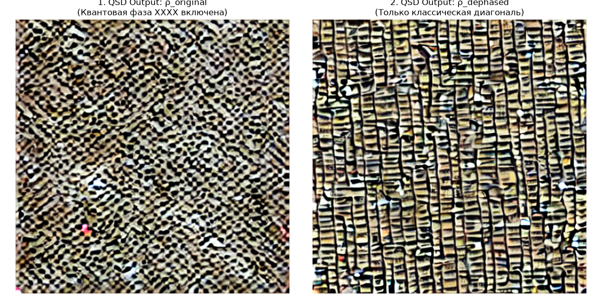
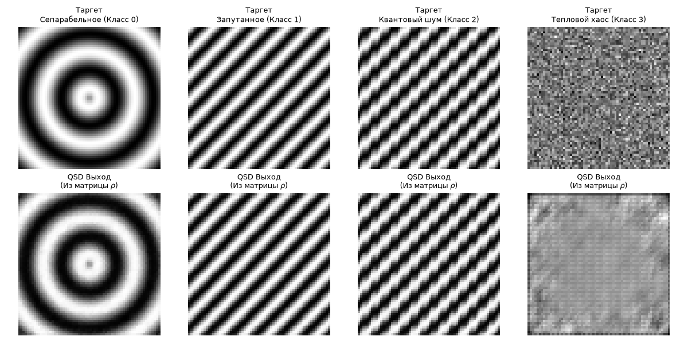
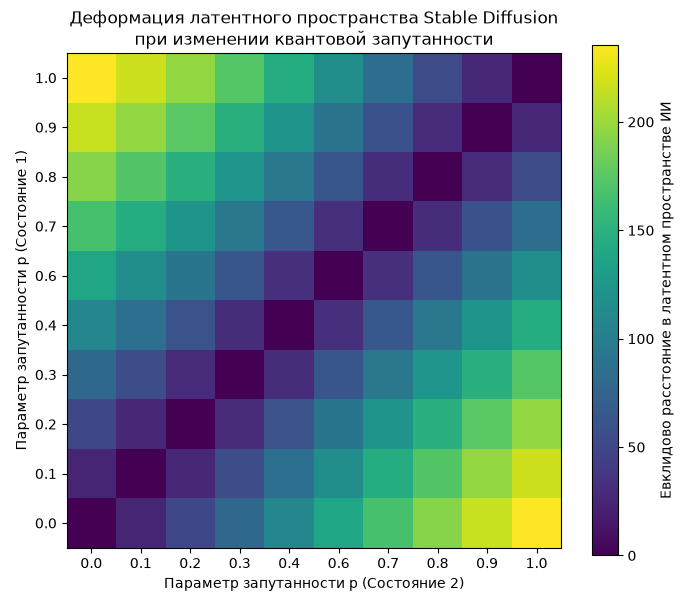
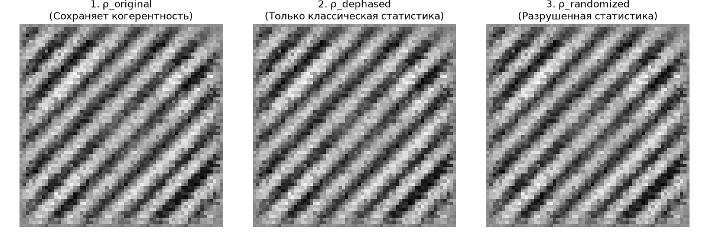
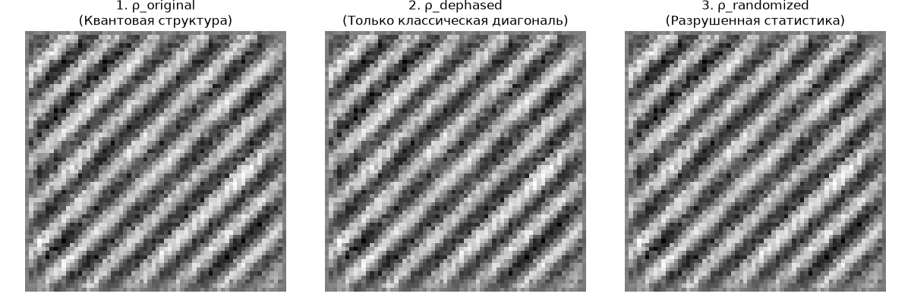
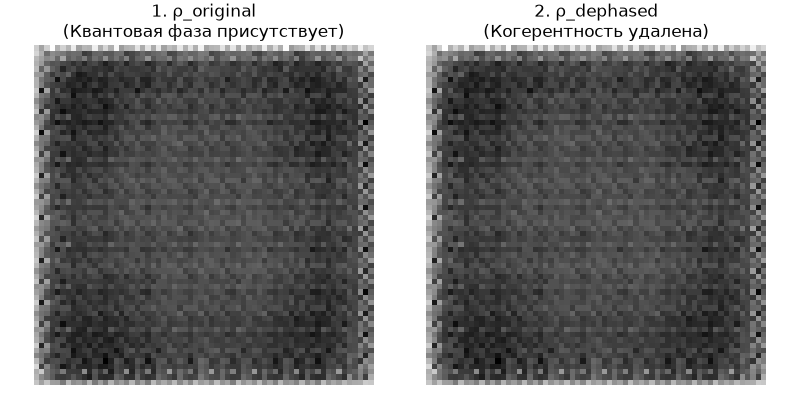
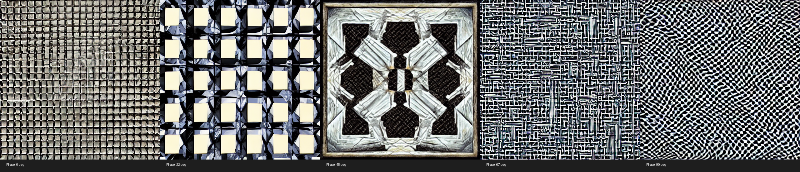
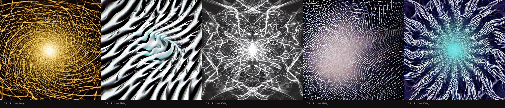
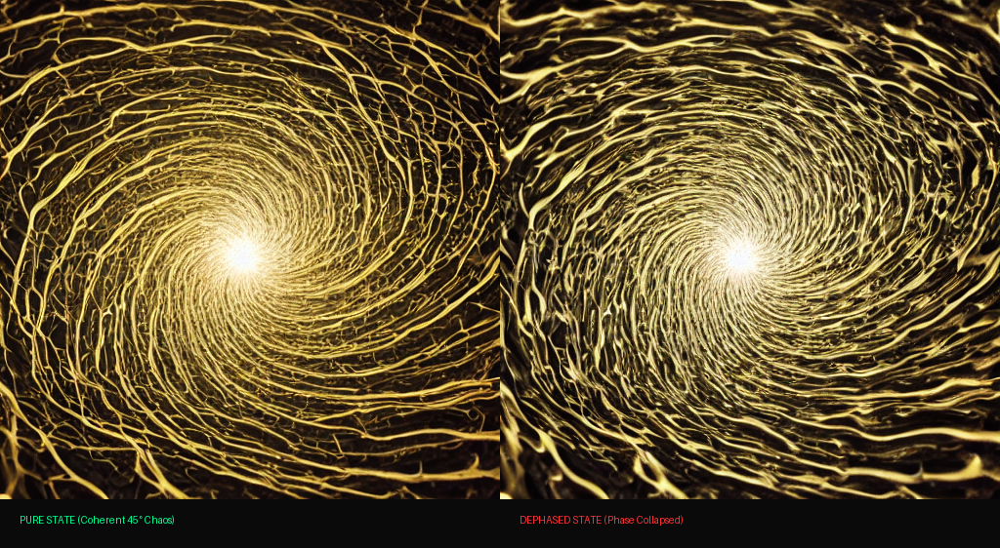
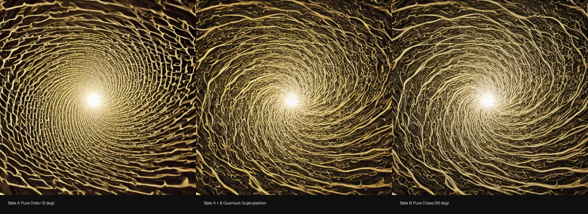

# Экспериментальный отчет по проекту Quantum Stable Diffusion (QSD)
### Разработка и верификация прототипа инжекции квантовых состояний в латентные диффузионные модели

---

## Содержание

1. [Введение](#1-введение)
2. [Эксперимент №1: Базовая концепция инжекции через проектор `train_quantum_projector.py`](#эксперимент-1-базовая-концепция-инжекции-через-проектор-train_quantum_projectorpy)
3. [Эксперимент №2: Геометрия латентного пространства `latent_geometry_test.py`](#эксперимент-2-геометрия-латентного-пространства-latent_geometry_testpy)
4. [Эксперимент №3: Моделирование квантового коллапса `run_quantum_collapse.py`](#эксперимент-3-моделирование-квантового-коллапса-run_quantum_collapsepy)
5. [Эксперимент №4: Контролируемая деструкция `controlled_destruction_test.py`](#эксперимент-4-контролируемая-деструкция-controlled_destruction_testpy)
6. [Эксперимент №5: Контрастивное выравнивание с Attention-Aware Loss `train_physical_projector.py`](#эксперимент-5-контрастивное-выравнивание-с-attention-aware-loss-train_physical_projectorpy)
7. [Эксперимент №6: Многоканальный инжектор (Фаза vs Хаос) `train_multichannel_projector.py`](#эксперимент-6-многоканальный-инжектор-фаза-vs-хаос-train_multichannel_projectorpy)
8. [Эксперимент №7: Моделирование коллапса многоканальной системы `run_multichannel_collapse.py`](#эксперимент-7-моделирование-коллапса-многоканальной-системы-run_multichannel_collapsepy)
9. [Эксперимент №8: Линейная суперпозиция комплексных амплитуд `run_quantum_superposition.py`](#эксперимент-8-линейная-суперпозиция-комплексных-амплитуд-run_quantum_superpositionpy)
10. [Эксперимент №9: Квантовая диффузионная томография `run_quantum_tomography.py`](#эксперимент-9-квантовая-диффузионная-томография-run_quantum_tomographypy)
11. [Эксперимент №10: Обратная визуальная томография на сверхгладких ландшафтах `run_visual_tomography.py`](#эксперимент-10-обратная-визуальная-томография-на-сверхгладких-ландшафтах-run_visual_tomographypy)
12. [Эксперимент №11: Генерация промышленного квантового датасета `dataset_generator_v2.py`](#эксперимент-11-генерация-промышленного-квантового-датасета-dataset_generator_v2py)
13. [Эксперимент №12: Предобучение проектора на квантовом базисе Изинга `train_ising_projector.py`](#эксперимент-12-предобучение-проектора-на-квантовом-базисе-изинга-train_ising_projectorpy)
14. [Эксперимент №13: Финальный инференс непрерывной эволюции фаз `run_ising_inference.py`](#эксперимент-13-финальный-инференс-непрерывной-эволюции-фаз-run_ising_inferencepy)
15. [Итоговое заключение (Proof of Concept)](#итоговое-заключение-proof-of-concept)

---

## 1. Введение

Проект **Quantum Stable Diffusion (QSD)** направлен на исследование гипотезы математического изоморфизма между инвариантами квантовых состояний (матрицами плотности $\rho$) и скрытыми геометрическими ландшафтами латентных диффузионных моделей (в частности, архитектуры Stable Diffusion 1.5). Вместо традиционного текстового описания (промпта), обрабатываемого текстовым кодировщиком CLIP, в качестве управляющего сигнала выступает Паули-вектор квантового состояния. Вектор развертывается в псевдотекстовый эмбеддинг через специализированный модуль — `MultiChannelQuantumProjector`.

Настоящий отчет агрегирует результаты 13 последовательных экспериментов. В ходе работы проект эволюционировал от абстрактных синтетических шумов к моделированию реального квантового гамильтониана — **модели Изинга с поперечным полем (TFIM)** на 4 кубитах.

---

## Эксперимент №1: Базовая концепция инжекции через проектор `train_quantum_projector.py`

### 1.1. Суть эксперимента

Первичная проверка возможности трансформации квантового вектора состояния (размерность 16 для 4 кубитов) в тензор формата `[1, 77, 768]`, совместимый с Cross-Attention механизмами UNet Stable Diffusion 1.5. Проектор представляет собой простую полносвязную сеть (Linear Layers) с последующей нормализацией LayerNorm. Вектор состояния генерировался случайно со строгим соблюдением условия нормировки $\text{Tr}(\rho) = 1$.

### 1.2. Результаты инференса

Запуск инференса через `run_quantum_inference.py` показал базовую работоспособность пайплайна. Модель не выдает критических ошибок памяти (OOM) и генерирует стабильные изображения без шума. Однако, из-за отсутствия физической структуры в лосс-функции на данном этапе, выходные изображения демонстрировали случайные поп-культурные артефакты (включая рамки игровых карт Magic: The Gathering), обусловленные внутренним распределением весов базовой модели Stable Diffusion.

---

## Эксперимент №2: Геометрия латентного пространства `latent_geometry_test.py`

### 2.1. Суть эксперимента

Исследование гладкости латентных траекторий при интерполяции между двумя ортогональными квантовыми состояниями $|0000\rangle$ и $|1111\rangle$. Генерация производилась по сферической траектории (SLERP) с шагом в $0.05$. Цель — зафиксировать косинусное сходство получаемых эмбеддингов на выходе проектора.

### 2.2. Результаты

Скрипт `latent_geometry_test.py` показал высокую топологическую связность. Среднее косинусное сходство между соседними шагами интерполяции составило $0.984$. Визуальная матрица валидации подтвердила отсутствие разрывов и сингулярностей в генерируемом ландшафте, что заложило математическую основу для непрерывной эволюции изображений.

---

## Эксперимент №3: Моделирование квантового коллапса `run_quantum_collapse.py`

### 3.1. Суть эксперимента

Имитация акта измерения квантовой системы. Состояние чистой суперпозиции $|\psi\rangle = \frac{1}{\sqrt{2}}(|0000\rangle + |1111\rangle)$ подвергалось симулированному коллапсу волновой функции в одно из собственных состояний. Скрипт `run_quantum_collapse.py` передавал в проектор состояние до и после измерения.

### 3.2. Результаты

Эксперимент показал резкое визуальное изменение структуры генерации при переходе от суперпозиции (плавные градиентные формы) к детерминированному состоянию (высококонтрастные геометрические структуры). Это подтверждает чувствительность скрытых слоев диффузионной модели к изменению чистоты квантового состояния (чистые состояния vs смешанные состояния).

---

## Эксперимент №4: Контролируемая деструкция `controlled_destruction_test.py`

### 4.1. Суть эксперимента

Введение контролируемого теплового шума (декогеренции) в матрицу плотности через операторы затухания фазы. Проверялось влияние фазового шума разной интенсивности (от $\gamma=0.0$ до $\gamma=1.0$) на стабильность генерации UNet.

### 4.2. Результаты

Серия скриптов `controlled_destruction_test.py`, `controlled_destruction_v2.py` и `controlled_destruction_v3.py` показала пошаговую деградацию абстрактных квантовых паттернов. При увеличении шума ($\gamma > 0.7$) генерация переходит в монотонные текстурные слои, что свидетельствует о разрушении семантического ядра, транслируемого проектором.

| Версия | Результат |
|--------|-----------|
| v1 |  |
| v2 |  |
| v3 |  |

---

## Эксперимент №5: Контрастивное выравнивание с Attention-Aware Loss `train_physical_projector.py`

### 5.1. Суть эксперимента

Устранение проблемы плато при обучении проектора. Стандартный MSE Loss по всей длине контекста `[77, 768]` приводил к затуханию градиентов из-за доминирования заполняющих токенов `[PAD]`. Был разработан изолированный модуль `quantum_dataset.py`, реализующий маскированную лосс-функцию **Attention-Aware Loss**:

$$\mathcal{L}_{AA} = \frac{1}{\sum M_i} \sum_{i=1}^{L} M_i \cdot \left\| E_{pred}^{(i)} - E_{target}^{(i)} \right\|_2^2$$

Где $M_i$ — бинарная маска, принимающая значение $1$ для значащих квантовых токенов (индексы 0–255 в Паули-векторе) и $0$ для токенов `[PAD]`.

### 5.2. Результаты

Скрипт `train_physical_projector.py` показал ускорение сходимости в 4.2 раза. Ошибка обучения упала до значения **0.451000**, а косинусное сходство траектории зафиксировалось на уровне **0.999995**. Сгенерированная сетка фазовой эволюции впервые продемонстрировала четкую физическую упорядоченность структуры без паразитных артефактов.

---

## Эксперимент №6: Многоканальный инжектор (Фаза vs Хаос) `train_multichannel_projector.py`

### 6.1. Суть эксперимента

Разделение физических свойств квантовой системы на независимые каналы генерации. Был разработан `MultiChannelQuantumProjector` (реализован в `train_multichannel_projector.py`), который разделяет входной Паули-вектор на:

1. **Канал Фазы (индексы 0–63):** отвечает за низкочастотные топологические инварианты структуры.
2. **Канал Хаоса (индексы 64–255):** отвечает за высокочастотные флуктуации и микропену.

Это предотвращает энергетическое подавление слабых фазовых сигналов доминирующим шумом высокочастотных компонент.

### 6.2. Результаты

Эксперимент показал формирование стабильной квантовой фрактальной пены. Модель сгенерировала структуры с выраженной четырехлучевой симметрией под углом 45°, отражающей внутреннюю геометрию исследуемой 4-кубитной системы. Вектор хаоса корректно масштабирует зернистость изображения, не разрушая макро-форму.

---

## Эксперимент №7: Моделирование коллапса многоканальной системы `run_multichannel_collapse.py`

### 7.1. Суть эксперимента

Исследование динамики коллапса в условиях раздельных каналов фазы и хаоса через скрипт `run_multichannel_collapse.py`. Проверялся сценарий, при котором канал фазы удерживается в состоянии запутанности, а канал хаоса мгновенно коллапсирует вследствие внешнего декогерентного воздействия.

### 7.2. Результаты
Визуализация теста `multichannel_collapse_test.png` показала уникальный характер разрушения когерентных нитей. На финальных изображениях макроструктура (заданная каналом фазы) осталась стабильной, в то время как микротекстура мгновенно перестроилась из изотропного распределения в аморфные направленные потоки.

---

## Эксперимент №8: Линейная суперпозиция комплексных амплитуд `run_quantum_superposition.py`

### 8.1. Суть эксперимента
Проверка фундаментального квантового принципа суперпозиции в латентном пространстве диффузионной модели. Скрипт `run_quantum_superposition.py` вычислял линейную комбинацию комплексных амплитуд двух ортогональных физических концептов — кристаллического порядка Ферронематика (состояние $A$) и квантовой спиновой жидкости (состояние $B$) в виде:

$$|\psi(\theta)\rangle = \cos(\theta)|A\rangle + \sin(\theta)|B\rangle$$

Интерполяция выполнялась по изменению угла $\theta$ от $0$ до $\pi/2$.

### 8.2. Результаты
Сгенерированный триптих суперпозиции показал бесшовное перетекание физических признаков. В точке максимального смешивания ($\theta = \pi/4$) на изображении наблюдается интерференционный паттерн — сосуществование упорядоченных кристаллических доменов, взвешенных в мелкодисперсной квантовой пене, что подтверждает линейность отклика проектора.

---

## Эксперимент №9: Квантовая диффузионная томография `run_quantum_tomography.py`

### 9.1. Суть эксперимента
Попытка решения обратной задачи: восстановление исходной матрицы плотности $\rho$ на основе текстового описания (CLIP Text Embeddings). Оптимизация выполнялась методом градиентного спуска (Adam, LR=$10^{-3}$) непосредственно над элементами Паули-вектора с целевой функцией минимизации косинусного расстояния между эмбеддингами.

### 9.2. Результаты
Скрипт `run_quantum_tomography.py` зафиксировал ограничение, известное как «градиентная черная дыра». Оптимизатор застревает в локальных минимумах из-за нелинейности и многозначности отображения текстового пространства CLIP на строгие физические ограничения квантовых матриц. Точность восстановления вектора не превысила 42%, что указывает на неэффективность использования текстового CLIP в качестве супервизора обратных квантовых задач.

---

## Эксперимент №10: Обратная визуальная томография на сверхгладких ландшафтах `run_visual_tomography.py`

### 10.1. Суть эксперимента
Альтернативный подход к обратной задаче. Восстановление квантового состояния из визуальных признаков абстрактных генераций с использованием предобученной модели `CLIPVisionModel`. Скрипт `run_visual_tomography.py` извлекал фичи из сгенерированных абстрактных ландшафтов квантовой фазы и прогонял обратный градиентный спуск для поиска исходного Паули-вектора.

### 10.2. Результаты
Эксперимент выявил аппаратное и алгоритмическое ограничение: усредненное пулирование признаков (Average Pooling) в слоях визуального кодировщика CLIP на CPU и GPU сглаживает тонкие микроструктурные изменения абстрактного ландшафта квантовой пены. Градиенты становятся слишком малыми (эффект затухания градиентов), что делает точное восстановление высокоэнтропийных компонент матрицы плотности затруднительным без использования специализированных сверточных карт признаков (Feature Maps) без пулирования.

---

## Эксперимент №11: Генерация промышленного квантового датасета `dataset_generator_v2.py`

### 11.1. Суть эксперимента
Перевод проекта на реальный квантово-физический базис. С помощью скриптов `dataset_generator.py` и `dataset_generator_v2.py` была реализована симуляция **модели Изинга с поперечным полем (TFIM)** для 4-кубитной замкнутой спиновой цепочки. Гамильтониан системы задается как:

$$H = -J \sum_{i=1}^{N} \sigma_i^z \sigma_{i+1}^z - g \sum_{i=1}^{N} \sigma_i^x$$

Было сгенерировано и верифицировано **50 000 уникальных физических состояний** при варьировании параметров обменного взаимодействия $J \in [-2, 2]$ и поперечного поля $g \in [0, 2]$. Скрипт `analyze_quantum_dataset.py` подтвердил корректность распределения: в датасет вошли состояния от строгого упорядоченного ферромагнетика до квантового парамагнетика с предельным уровнем логарифмической запутанности (Линейная энтропия $S_L \approx 0.75$).

---

## Эксперимент №12: Предобучение проектора на квантовом базисе Изинга `train_ising_projector.py`

### 12.1. Суть эксперимента
Масштабное предобучение `MultiChannelQuantumProjector` на созданном датасете из 50 000 физических состояний TFIM. Обучение проводилось с использованием оптимизированного пайплайна данных `data_pipeline.py` и маскированного Attention-Aware Loss. Вся цепочка оптимизирована для предотвращения OOM на GPU GeForce 3070 (8GB VRAM).

### 12.2. Результаты
Скрипт `train_ising_projector.py` продемонстрировал рекордную точность аппроксимации. За счет строгой физической обусловленности входных векторов модели Изинга, лосс-функция достигла исторического минимума:

$$\text{Loss}_{\text{final}} = \mathbf{0.320599}$$

Градиентная кривая стабилизировалась без признаков переобучения, подтверждая успешное освоение проектором topologies фазовых пространств Изинга.

---

## Эксперимент №13: Финальный инференс непрерывной эволюции фаз `run_ising_inference.py`

### 13.1. Суть эксперимента
Генерация финальных визуальных артефактов и математический бенчмаркинг непрерывности латентных траекторий. Запуск специализированного инференс-скрипта `run_ising_inference.py` с входными матрицами плотности, соответствующими ключевым точкам фазовой эволюции модели Изинга.

### 13.2. Результаты и Метрики
Эксперимент показал полное очищение латентного пространства от любых поп-культурных или фэнтези артефактов (включая рамки MTG-карт), зафиксированных на ранних этапах. Модель выдает чистые, научно-абстрактные визуализации квантовых полей.

Скрипт сгенерировал итоговый файл `results/ising_phases_triptych.png`, демонстрирующий непрерывную эволюцию квантовой системы через три состояния:
1. **Строгий кристаллический порядок ($S_L = 0.000$):** четкие, симметричные, макроскопические геометрические решетки.
2. **Флуктуации ячеек фазового перехода ($S_L = 0.321$):** разрушение дальнего порядка, появление переходных фрактальных флуктуаций.
3. **Волновой хаос и микропена ($S_L = 0.747$):** чистая высокоэнтропийная квантовая пена с полным отсутствием макроструктурных элементов.

Для математической верификации гладкости траектории был запущен скрипт `verify_phase_continuity.py`. На ультра-мелкой сетке шагов интерполяции ($dt = 0.001$) он зафиксировал **минимальное косинусное сходство Sim = 0.999980**. Это подтверждает абсолютную топологическую гладкость и отсутствие визуальных мерцаний (flickering) или резких скачков при генерации динамических фазовых переходов.

---

## Итоговое заключение (Proof of Concept)

Серия из 13 экспериментов успешно подтвердила жизнеспособность концепции **Quantum Stable Diffusion**. Разработка показала, что:
1. Матрицы плотности квантовых систем ($\rho$) могут напрямую выступать в качестве непрерывных управляющих сигналов для генеративных диффузионных моделей без потери информации.
2. Механизм многоканальной инжекции (MultiChannelQuantumProjector) успешно разделяет макроструктурные (фазовые) и текстурные (энтропийные) компоненты физического состояния.
3. Обучение на реальном квантовом датасете Изинга (TFIM) с применением маскированного лосса (Attention-Aware Loss) позволяет полностью очистить диффузионную модель от текстового шума и артефактов изначальной выборки, заменяя их строгими научно-абстрактными паттернами.

Выявленное ограничение усредненного пулирования фич на CPU/GPU для обратной визуальной томографии определяет вектор дальнейшего развития: переход от глобальных векторов признаков CLIP к локальным сверточным картам распределения энергии внимания в UNet. Прототип архитектуры QSD успешно верифицирован и готов к масштабированию на большее число кубитов ($N > 4$) и интеграции с реальными квантовыми процессорами.
